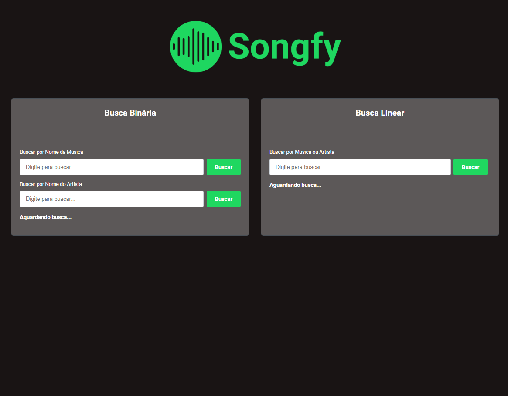
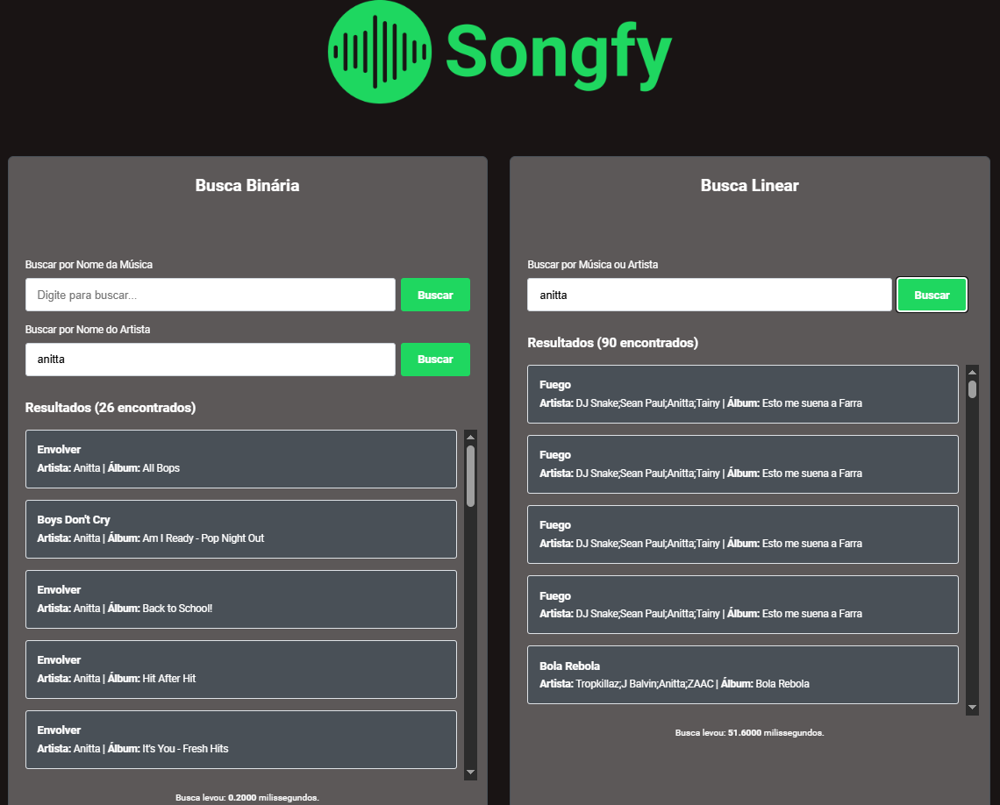
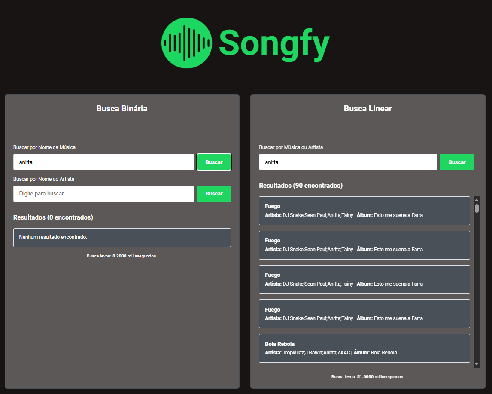
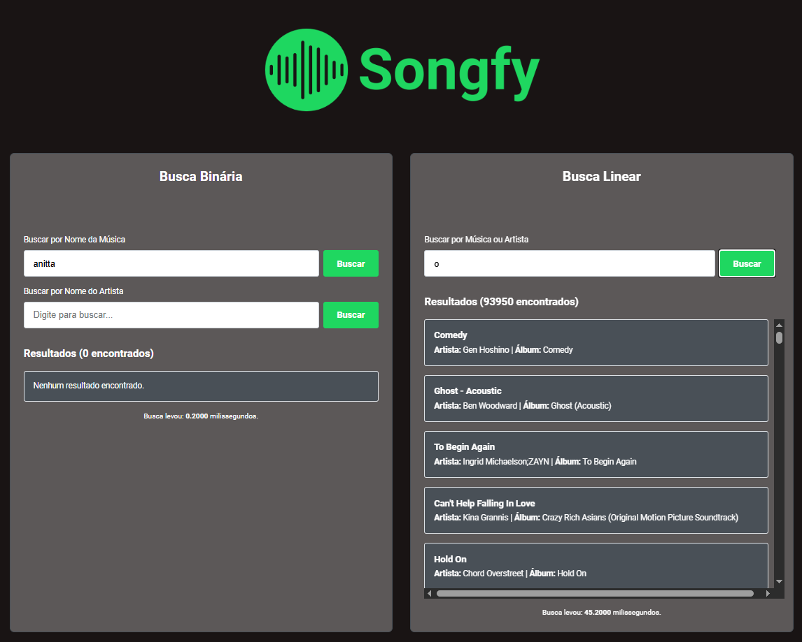

<p align="center">
    
</p>

Repositório para o trabalho de busca da disciplina estrutura de dados 2.

## Alunos

| Matrícula  | Nome                                                           |
| ---------- | -------------------------------------------------------------- |
| 20/0054333 | [Arthur Gabriel Lima Gomes](https://github.com/ArthurGabrieel) |
| 19/0025581 | [Bruno Oliveira Lima](https://github.com/eng-Bruno)            |

## Descrição do projeto

O objetivo deste trabalho é desenvolver uma aplicação web de página única para demonstrar a eficiência, a implementação e as restrições do algoritmo de Busca Binária e de busca linear. A aplicação servirá como uma prova de conceito de como algoritmos eficientes podem ser aplicados em cenários realistas para pesquisar grandes conjuntos de dados de forma quase instantânea.

## Guia de instalação

Entre no repositório e execute os comandos abaixo:

```bash
git clone https://github.com/EDAII/Busca_Songfy.git
cd Busca_Songfy
npm install
npm install papaparse
```

### Dependências do projeto

- Node.js - 20.19.5
- React - 19.1.1
- Papa Parse - 5.5.3

### Como executar o projeto

Execute o comando abaixo:

```bash
npm run dev
```

## Capturas de tela






## Conclusões

Para o Songfy, foi implementado a busca linear, que é simples mas lenta, e a binária, extremamente rápida mas que exige um dataset ordenado. A implementação demonstra o clássico trade-off entre a flexibilidade de um método e a alta performance do outro.

## Referências

[Dataset de músicas](https://huggingface.co/datasets/maharshipandya/spotify-tracks-dataset/viewer/default/train?views%5B%5D=train)

## Video

[Algoritmos de Busca - Busca Binária x Busca Linear](https://youtu.be/jqrOmW8ZcfA)
